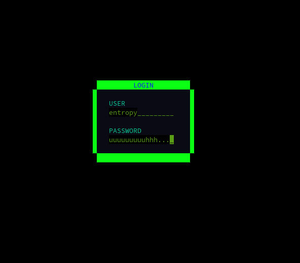
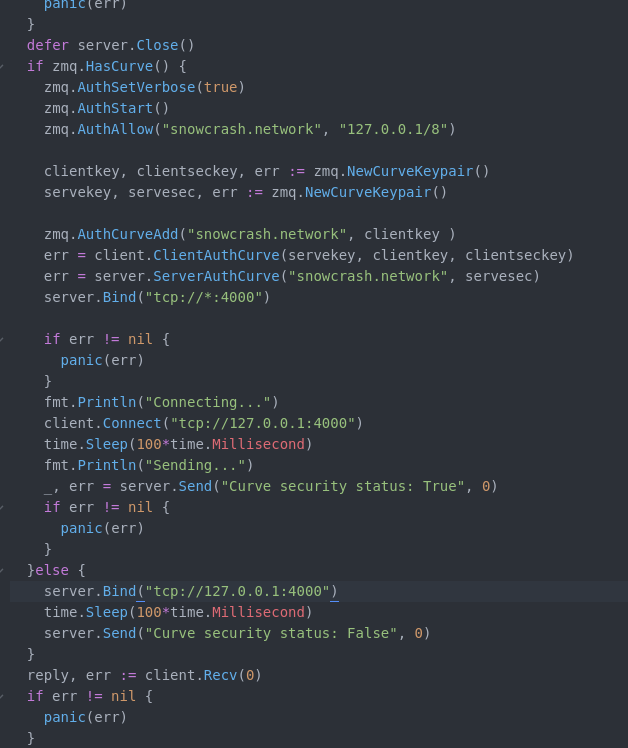
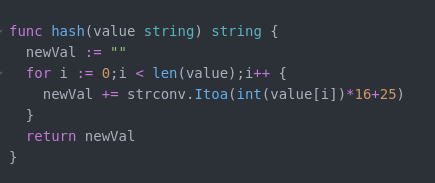

**The wonders of the year 2019**

Hah, it felt futuristic to type that.

The topic of today's blog is networking and hash functions. This MUD's first quirk is that it is not going to be running over telnet, and will require a client either made by the community or by me. The MUD itself is going to be a public facing API, linking playerfiles to database data. The user authenticates in their client, the connection from the client to the auth server is encrypted, and the password is stored in a hash table, which is a table of values that are consistently mangled by something called a hash function.

The hash function can be anything you want it to be, as long as it's consistent. For example. I'm going to take a UUID created by a chunk of code I wrote for the original social network, iterate over the characters and perform an arbitrary mathematical function on them. It will produce a string of "garbage", which we will store. The client will send a mangled key of its own, however the server will do the mangling, and associate the user with the key send at that time. As with most APIs, there will be a scope for each key, stored as a prefix on the hash function.
You might ask why bother? The answer is paranoia. If the database were ever to be compromised, the attacker dumping our precious playerfiles into their pockets, they would get a useless hashed garbage string instead of the password you happen to share with a facebook account.

So that's my reasoning.

Currently I have a working communication that utilizes zeromq for networking. zmq is one of my desert island libraries, I always manage to build something useful or fun with it with minimal hassle. 

and there we are! small asynchronous atomic communication! Encrypted by a set of keys generated at runtime even! No re-using old keys or storing them like so many acorns. However, this is the solution to a totally different problem than we were talking about. The hash function will look more like this

Now for securities sake I'm not going to be keeping this formula, but it makes sense, no? mangle the string but do it in a way that's reproducible. That's what a hash function is all about.

So there we go! I'm working on refactoring the current client into a zmq utilizing API otherwise, so that's all for tonight.
